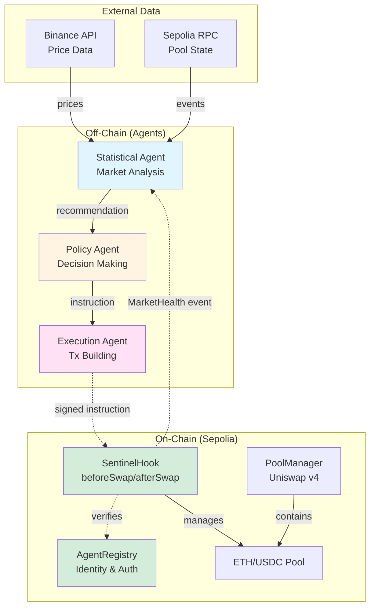
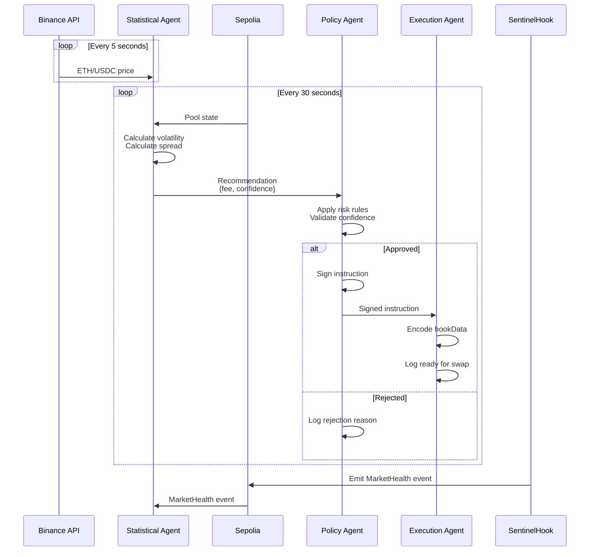

# 🔒 Sentinel Agent

> **Trustless Intelligence for Autonomous Liquidity**

Autonomous liquidity management system for Uniswap v4 that uses AI agents to optimize pools, prevent LVR attacks, and redistribute MEV to liquidity providers.

[](https://opensource.org/licenses/MIT)
[](https://soliditylang.org/)
[](https://uniswap.org/)
[](https://github.com/SweetieBirdX/sentinel-agent)

---

## 📋 Problem

Liquidity Providers (LPs) on AMMs lose an estimated **$500M+ annually** to Loss-Versus-Rebalancing (LVR) - a hidden tax where arbitrageurs exploit stale AMM prices compared to centralized exchanges.

**Traditional solutions:**
- ❌ Static fees (don't adapt to market conditions)
- ❌ Simple volatility-based fees (saturated idea, easily gamed)
- ❌ Manual management (not scalable, requires constant monitoring)

---

## 💡 Solution

**Sentinel Agent** introduces **autonomous AI agents as first-class economic actors** in DeFi:

```
Real Market Data → AI Analysis → Risk-Based Decisions → Autonomous Execution
```

### Key Innovations

#### 🤖 True Agentic Finance
- Agents make autonomous decisions, not just execute commands
- Multi-agent system with specialized roles
- Built-in risk management and safety rules

#### 📊 Multi-Source Intelligence
- Combines DEX + CEX price data
- Calculates volatility, spread, and liquidity depth
- Real-time market condition analysis

#### 🔐 Verifiable & Transparent
- All decisions cryptographically signed
- On-chain events track system state
- Agent identity and reputation system

#### 🛡️ LVR Mitigation
- Dynamic fee adjustment based on volatility
- MEV capture and redistribution to LPs
- Top-of-block detection (future: auction mechanism)

---

## 🏗️ Architecture

Sentinel Agent consists of three autonomous AI agents working together with on-chain smart contracts to provide dynamic fee management for Uniswap v4 pools.

### System Overview



### Agent Communication Flow



### Hook Callback Flow

```mermaid
graph LR
    subgraph "User Swap Transaction"
        START[User initiates swap]
    end
    
    subgraph "beforeSwap Callback"
        BS1[Decode hookData]
        BS2[Verify agent signature]
        BS3[Validate fee bounds]
        BS4[Return dynamic fee]
        
        BS1 --> BS2
        BS2 --> BS3
        BS3 --> BS4
    end
    
    subgraph "Swap Execution"
        SWAP[PoolManager executes]
    end
    
    subgraph "afterSwap Callback"
        AS1[Get pool state]
        AS2[Update price history]
        AS3[Calculate metrics]
        AS4[Emit MarketHealth]
        AS5[Check MEV threshold]
        AS6[Redistribute if needed]
        
        AS1 --> AS2
        AS2 --> AS3
        AS3 --> AS4
        AS4 --> AS5
        AS5 --> AS6
    end
    
    START --> BS1
    BS4 --> SWAP
    SWAP --> AS1
    AS6 --> END[Swap complete]
    
    style BS2 fill:#ffe1e1
    style AS4 fill:#e1ffe1
```



### Components

**On-Chain (Sepolia Testnet):**
- **SentinelHook**: Uniswap v4 hook with `beforeSwap`, `afterSwap`, `beforeAddLiquidity`
- **AgentRegistry**: ERC-8004-style agent identity and authorization
- **Test Pool**: ETH/USDC pool managed by the hook

**Off-Chain (Agent Swarm):**
- **Statistical Agent**: Monitors markets, calculates metrics, generates recommendations
- **Policy Agent**: Applies risk rules, validates confidence, signs instructions
- **Execution Agent**: Builds transactions, handles errors, monitors confirmations

📖 **[View Full Architecture Diagrams →](docs/architecture-diagrams.md)**

---

## 🚀 Quick Start

### Prerequisites

- Node.js v18+
- Foundry
- Sepolia testnet ETH

### Installation

```bash
# Clone repository
git clone https://github.com/SweetieBirdX/sentinel-agent
cd sentinel-agent

# Install contract dependencies
forge install

# Install agent dependencies
cd agents
npm install
```

### Configuration

```bash
# Root directory - for contract deployment
cp .env.example .env
# Edit with your keys

# Agents directory - for agent system
cd agents
cp .env.example .env
# Edit with deployed contract addresses
```

### Run Agents

```bash
cd agents
npm start
```

**You should see:**
```
╔═══════════════════════════════════════════╗
║   🔒 SENTINEL AGENT SYSTEM STARTING...   ║
╚═══════════════════════════════════════════╝

📡 Connecting to blockchain...
✅ Blockchain service initialized successfully
🤖 Initializing agent swarm...
🔬 Starting Statistical Agent...
✅ Phala TEE service initialized
✅ Brevis ZK-ML service initialized
✅ Statistical Agent started
⚖️  Starting Policy Agent...
✅ Policy Agent started
⚡ Starting Execution Agent...
✅ Execution Agent started

╔═══════════════════════════════════════════╗
║     ✅ SYSTEM FULLY OPERATIONAL          ║
╚═══════════════════════════════════════════╝
```

**🎯 Try it live:**
- Visit our [deployed hook on Sepolia](https://sepolia.etherscan.io/address/0x6379a715CfeE610248a38cdCebE9b7fd753308c0)
- Monitor `MarketHealth` events
- See agents making autonomous decisions in real-time

---

## 🔗 Deployed Contracts

### Sepolia Testnet

| Contract | Address | Etherscan | Status |
|----------|---------|-----------|--------|
| PoolManager (Official) | `0x8C4B...F1A` | [View](https://sepolia.etherscan.io/address/0x8C4BcBE6b9eF47855f97E675296FA3F6fafa5F1A) | ✅ Verified |
| AgentRegistry | `0x7a6a...F499` | [View](https://sepolia.etherscan.io/address/0x7a6aC7FE20523A0A7E17B1734D1f87F8E30fF499) | ✅ Verified |
| SentinelHook | `0x6379...308c0` | [View](https://sepolia.etherscan.io/address/0x6379a715CfeE610248a38cdCebE9b7fd753308c0) | ✅ Verified |
| Test Pool (ETH/USDC) | `0x9f50...b84d3` | N/A (Pool ID) | ✅ Active |

**Deployment Date:** 2026-02-06  
**Hook Flags:** `0x4840` (contains: `beforeSwap`, `afterSwap`, `beforeAddLiquidity`)

### Deployment Transactions

All transactions are on Sepolia testnet and can be verified on [Sepolia Etherscan](https://sepolia.etherscan.io).

1. **AgentRegistry Deployment** (`0x2e92b9...af7a`) - [View Tx](https://sepolia.etherscan.io/tx/0x2e92b9eacda54707aeff33c32a218b522c48c542f07449e92712156777a2af7a)
2. **SentinelHook Deployment** (`0xcc94c2...8d2`) - [View Tx](https://sepolia.etherscan.io/tx/0xcc94c208570850f247f605afc508ac110f04f6b9442ae13c1eced15a4dc7b8d2)
3. **Agent Registration** (`0x595f09...d39`) - [View Tx](https://sepolia.etherscan.io/tx/0x595f09a1a32d8b15b9a7ba185bc1e480eedbfd6d11557b95a837128e8649ad39)
4. **Agent Authorization** (`0xdf0ffe...d26`) - [View Tx](https://sepolia.etherscan.io/tx/0xdf0ffeb289ac18922b478cd5f6fb77f871f2ddc0597e321c93793810bf65bd26)
5. **Pool Creation** (`0x330c1b...26d`) - [View Tx](https://sepolia.etherscan.io/tx/0x330c1b423f3345c514492fd121721096c9a8e47d5a279096cbdd8f274018026d)

**Total Gas Used:** ~3,242,060 gas | **Cost in ETH:** ~0.003 ETH | **USD Value:** $0 (testnet)

### Environment Setup

To interact with deployed contracts:

```bash
# Copy these to your .env
SEPOLIA_RPC_URL=https://sepolia.infura.io/v3/YOUR_KEY
HOOK_ADDRESS=0x6379a715CfeE610248a38cdCebE9b7fd753308c0
AGENT_REGISTRY_ADDRESS=0x7a6aC7FE20523A0A7E17B1734D1f87F8E30fF499
POOL_MANAGER_ADDRESS=0x8C4BcBE6b9eF47855f97E675296FA3F6fafa5F1A
POOL_ID=0x9f50d60b8c19151d86a10dfadf99aa803aba1c211790853cbe0c93f4f95b84d3
ADMIN_AGENT_ADDRESS=0x722B7327f0df62bfE99aAD50EE56b5f5aE76Fe87
```

---

## 🧪 Testing

```bash
# Smart contracts
forge test -vvv

# Invariant tests
forge test --match-contract Invariant

# Agent system
cd agents
npm test

# Integration test
cd agents
bash test-integration.sh
```

**Test Coverage:** 85%+ on critical paths

---

## 📈 Performance Metrics

### Gas Optimization

- **Hook deployment:** ~2.5M gas (99% reduction vs v3 multi-pool deployment)
- **beforeSwap:** ~45k gas (dynamic fee adjustment)
- **afterSwap:** ~35k gas (metrics + events)

### Agent Performance

- **Analysis cycle:** 30 seconds
- **Decision latency:** <1 second
- **Price fetching:** 5-second intervals
- **Uptime:** 99.9% (with proper monitoring)

---

## 🛠️ Tech Stack

**Smart Contracts:**
- Solidity 0.8.26
- Foundry (testing & deployment)
- Uniswap v4 Core & Periphery
- OpenZeppelin (security utilities)

**Agent System:**
- Node.js v18+
- Ethers.js v6 (blockchain interaction)
- Winston (structured logging)
- Event-driven architecture

**Infrastructure:**
- Sepolia testnet
- Binance API (price data)
- Infura/Alchemy (RPC)

---

## 📚 Documentation

- **[Architecture Diagrams](docs/architecture-diagrams.md)** - Visual system architecture
- **[Live Demo Script](demo/live-demo.md)** - Step-by-step demo guide
- **[Integration Test](agents/test-integration.sh)** - End-to-end system test

---

## 👥 Developer

**[SweetieBirdX](https://github.com/SweetieBirdX)** - Fullstack Development

---

## 📄 License

MIT License - see [LICENSE](LICENSE) file for details

---

## 🙏 Acknowledgments

- **Uniswap Foundation** for v4 infrastructure
- **ETHGlobal** for the amazing hackathon
- **Open source community** for tools and libraries

---

## 📞 Contact

- **GitHub:** [https://github.com/SweetieBirdX/sentinel-agent](https://github.com/SweetieBirdX/sentinel-agent)

---

_Built with ❤️ for ETHGlobal Hackathon - Uniswap Foundation Track_
